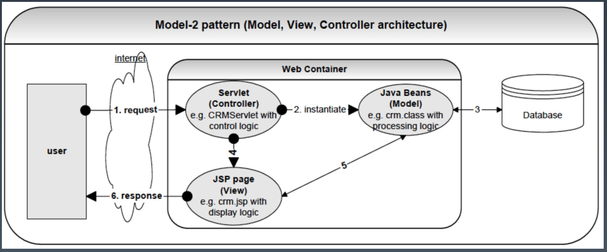

# Java Project

## 课程大纲

### 模块一：Java EE 标准架构 - Java 分布式架构的起手式

#### 教学目标：

1. 理解 Java 生态系统、企业级架构和技术规范（JSR）。

1. 学会使用 Java 标准技术栈实现互联网平台项目。

1. 使用 CI/CD 工具实现项目持续交付，构建自动化平台。

1. 使用 Java Security 实现平台访问控制和安全防护。

1. 熟练运用 Java EE 容器实现平台高可用、高性能以及高并发的需要。

#### 学习和工作中的痛点：

1. 日常工作对 Java 标准技术、规范和 API 知之甚少，阅读框架源码举步维艰。

1. 项目代码变更之后，缺乏自动化测试和试运行机制，产品质量得不到有效的保障。

1. 作为一名业务开发，日常项目中缺乏访问控制和 Web 安全防控的意识。

1. 作为一名开发人员，对于运维体系和手段相对陌生，无法运用 Java EE 容器内建特性达到运维目的。

1. 由于企业系统规模的局限，缺少实践高可用、高性能和高并发 Java 分布式架构的机会。

#### 通过学习掌握的核心能力：

1. 技术规范：了解项目中所使用的 Java 规范和 API 接口。

1. 实战运用：使用标准 Java 技术以及开源框架迭代实现项目需求。

1. 安全防控：理解服务认证和授权架构，并结合 Java EE 容器实现访问控制；了解常见 Web 攻击手段，构建安全 Web 服务。

1. DevOps：打造项目的运维体系，包括 codebase 管理、项目构建工具运用、CI/CD 平台搭建、以及基于 Java 实现服务监控、日志管理以及配置管理等。

#### 详细内容：

1. 规范运用：使用 Java SE 和 Java EE 技术栈实现业务需求，如 Web 规范（Servlet、JSP 和 JSTL）、REST 规范（JAX-RS）、数据存储规范（JDBC 和 JPA）、消息服务规范（JMS）、安全（Java Security）、监控管理（JMX）、日志（Java Logging）、缓存（Java Caching）等。

1. 质量保证：运用 codebase 平台工具实现代码变更通知、代码分析以及 Code Review 流程，并使用 GitHub/GitLab CI 工具集成 Maven 生态构建自动化测试平台。

1. 视图渲染：基于 JSP、EL 以及 JSTL 技术实现 Java Web 服务端视图渲染，如用户登录页面。

1. 服务通讯：基于 JAX-RS 实现同步服务通讯，如用户登录场景。基于 JMS 提供异步服务通讯能力，如用户详情信息更新。

1. 访问控制：使用 Java EE 容器认证和授权架构实现访问控制。

1. Web 安全：了解 SQL 注入、CSRF、XSS、HSTS 等攻击手段，结合 Java Security 提升加密解密和安全防护能力。

1. 负载均衡：使用多 Java EE 容器对等部署的方式，达到均衡服务器压力的目的。

1. 单点登录：通过 Java EE 容器 Session 复制等手段提供项目 Web 应用的单点登录能力。

1. 监控管理：使用 Java JMX（Java 管理扩展）对关键服务进行监管，理解 JMX 架构和不同类型的 MBean 使用场景。

1. 日志管理：使用 Java Logging 作为系统日志框架，理解其整体设计和架构。

1. 配置管理：使用 Java EE 配置管理，理解 ServletContext Config、ServletConfig、JVM 启动参数、Java 系统属性以及环境变量等外部化配置差异，整合 Apache Commons Configuration 实现配置抽象。

1. API 网关：基于 Servlet 异步技术实现高性能 API 网关。

1. 性能压测：通过 JDK 动态代理和 Servlet Filter 方式，对项目关键服务进行性能埋点，评估 API 性能指标。

1. 性能提升：结合压力测试结果，运用 Java Caching 整合 Redis 以及异步技术，提升系统性能。


### 模块二：Java 开源混合架构 - 互联网标配 Java 分布式架构

#### 教学目标：

1. 使用 Spring 技术栈和其他开源框架重构当前项目。

1. 通过项目重构，理解 Spring 技术生态与 Java 标准技术之间的联系和差异，以及 Spring 技术栈的设计思想和实现模式。

1. 利用非 Java 基础设施提升平台应用的整体性能。

#### 学习和工作中的痛点：

1. 公司项目的技术单一，对 Java 技术生态缺少技术选型的判断力和决策力。

1. 日常开发能够熟练使用 Spring 技术栈，然而对其生态缺乏整体认识，对框架细节相对陌生。

1. 长期从事 Java  服务端研发，对于非 Java 技术栈如何提升平台性能缺少实战经验。

#### 通过学习掌握的核心能力：

1. 架构重构：使用标准 Java 技术、Spring 以及其他开源框架迭代重构当前项目。

1. 技术选型：从实现成本和学习曲线等多维度对比标准 Java 技术生态、Spring 技术生态以及其他开源框架。

1. 安全防控：了解 Spring Security 特性和架构，并运用其特性重构项目的访问控制和 Web 安全实现。

#### 详细内容： 

1. 数据存储：使用 MyBatis 和 Spring Data JPA 重构项目 JDBC 封装实现。

1. 测试用例：基于 Spring Testing 重构项目单元测试和集成测试。

1. 视图渲染：基于 Spring Web MVC 重构业务实现，并复用 JSP、EL 以及 JSTL 页面。

1. 服务通讯：基于 Spring Web MVC 适配 JAX-RS 注解，实现业务代码复用，使用 Spring JMS 重构项目遗留 JMS 实现。

1. 访问控制：使用 Spring Security 提升认证和授权架构，实现访问控制。

1. Web 安全：使用 Spring Security  简化 CSRF、XSS、HSTS 等实现，并理解该框架的架构设计理念。

1. 负载均衡：利用 Nginx 作为反向代理服务器，更替 Java-Based Web Server 实现。

1. 单点登录：使用 Spring Session 升级项目遗留的单点登录实现。

1. 服务监控：基于 Spring JMX 重构项目中 MBean 的管理，理解 Spring JMX  @ManagedResource 注解，简化 JMX 开发的实现细节。

1. 日志管理：使用 Spring Logging API 替换现有的 Java Logging 实现，并理解它与 Apache Commons Logging 以及 SLF4J 的区别。

1. 配置管理：基于 Spring 外部化配置重构当前项目基于 Apache Commons Configuration 的配置抽象实现。

1. API 网关：基于 Nginx 构建系统 API 网关，利用 Spring WebFlux 实现业务 API 网关。

1. 性能压测：使用 Spring AOP 替换项目性能埋点实现，并重新评估重构后的 API 性能指标。

1. 性能提升：使用 Spring Caching 抽象重构 Java Caching 标准实现，运用 Nginx 实现动态内容和静态内容分离，使用 Varnish 提升 Web 整体性能。


### 模块三：SOA 架构 - 分布式架构变革的开始

#### 教学目标：

1. 构建 SOA 理论体系，了解 SOA 解决方案，为项目选型提供参考。

1. 使用 SOA 的模式和实现升级当前项目的架构，使其符合 SOA 的原则。

1. 引入 Apache Dubbo Admin 技术，提升项目运维能力。

1. 运用全链路压测，对重构后的 SOA 应用进行性能评估。

1. 实现灰度发布策略，确保应用更迭安全稳定。

#### 学习和工作中的痛点：

1. 在日常开发中更多的关注是功能实现和框架运用，对于 SOA 架构并未建立清晰的理论体系。

1. 没有接触过服务治理、负载均衡、服务路由、服务熔断、三方登录等分布式高阶场景。

1. 目前应用规模无法触及高并发场景，缺少自动化和精细化测量业务完整链路的性能指标。

1. 尽管回归测试相对完善，然而项目发布时仍提心吊胆，无法在生产环境执行小规模测试。

#### 通过学习掌握的核心能力：

1. 理论知识：理解 SOA 的概念、原则、模式、实现以及延伸架构，如：事件驱动架构、WebServices、REST 等。

1. 架构升级：使用 SOA 架构配套的基础设施，升级当前项目架构。

1. 服务注册与发现：理解服务注册与发现理论，掌握不同注册中心技术选型的使用场景。

1. 负载均衡：理解常见负载均衡算法，把握它们的适用场景。

1. 服务路由：了解服务路由的使用场景，掌握动态服务路由的实现原理。

1. 服务高可用：了解服务熔断、降级以及限流的原理和差异。

1. 安全控制：理解 OAuth2 架构和原理，帮助项目提升认证和授权的能力。

1. 全链路压测：掌握全链路压测系统的设计模式，寻找服务性能短板。

1. 灰度发布：掌握灰度发布的实现策略，理解不同基础设施实现的利弊。

#### 详细内容：

1. 服务通讯：使用 Apache Dubbo 替换项目部分 REST API 同步服务，使用 Spring Kafka 重构异步服务通讯。

1. 数据存储：使用 Apache ShardingSphere 增加数据库分库分表能力。

1. 服务注册与发现：理解 Dubbo Registry SPI 以及不同的基础设施实现，如：ZooKeeper、Consul 和 Nacos 等。

1. 负载均衡：理解 Dubbo LoadBalance SPI 设计以及各种不同的实现，结合项目实际情况，合理选型。

1. 服务路由：理解 Dubbo Route SPI 设计与实现，并模拟实现多区域用户路由到不同的 Dubbo 服务机房。

1. 配置管理：使用 Nacos Spring 提升分布式动态配置。

1. 服务高可用：基于 Netflix Hystrix 和 Alibaba Sentinel 实现 Web 服务和 Dubbo 服务熔断、降级和限流。

1. 服务监控：使用 Apache Dubbo Admin 提升项目 DevOps 能力，如：治理 Dubbo 服务、实现延迟暴露、优雅上下线、动态路由等。

1. 安全和控制： 基于 Spring Security 提升 Dubbo 服务认证和授权能力。

1. 全链路压测：基于JMeter 技术，再结合库表设计，实现平台业务全链路压测。

1. 灰度发布：基于 Nginx 插件提供平台灰度发布的能力。


### 模块四：微服务架构 - 轻量级 SOA 架构？

#### 教学目标：

1. 理解微服务架构的概念、与 SOA 架构的区别，以及常见的实现模式。

1. 运用微服务架构理论和基础设施升级平台架构。

1. 使用前后端分离技术实现服务端视图渲染。

1. 借用灰度发布策略，逐步完成 SOA 架构到微服务架构的过渡。

#### 学习和工作中的痛点：

1. 时常听到微服务架构的理论和实践案例，但不清楚它与 SOA 到底存在哪些区别。

1. 公司为顺应潮流，要求将所有应用架构升级到微服务架构，然而缺少应用合理拆分的理论指导，也不清楚如何应对拆分后的潜在风险。

1. 应用架构升级到微服务过程中，伴随着基础设施的升级，又需要学习新的技术，感觉力不从心。

1. 长期从事服务端研发，对前端技术的发展不了解，缺少前后端分离技术的实践经验。

#### 通过学习掌握的核心能力：

1. 理论知识：掌握微服务架构理论体系，了解微服务最佳实践。

1. 架构升级：使用 Spring Boot 和 Spring Cloud 升级 Java 基础设施。

1. 架构过渡：掌握不同发布策略的实质和区别，合理选择架构过渡方案。

1. 技术提升：理解 Spring Boot/Spring Cloud 核心特性和架构设计。

#### 详细内容：

1. 数据存储：使用第三方  Spring Boot Starter 重构 MyBatis 和 Apache ShardingSphere 实现，并使用 Spring Boot 官方 Starter 针对 JPA 和 Caching 等进行升级。

1. 测试用例：学习并使用 Spring Boog Testing 重构集成测试。

1. 视图渲染：使用 Vue.js 替换 Java Web Server 服务端视图渲染。

1. 服务通讯：使用 Dubbo Spring Cloud 重构同步服务，基于 Spring Cloud Stream 重新实现异步服务。

1. 访问控制：使用 Spring Security OAuth 提升认证和授权架构，实现访问控制。

1. Web 安全：使用 Spring Security Starter 配置化实现 CSRF、XSS、HSTS。

1. 负载均衡：使用 Spring Cloud LoadBalancer 抽象重构 REST 负载均衡。

1. 服务监控：理解 Spring Boot Actuator 体系，使用 Spring Boot Admin 提升 Spring Boot 应用运维能力。

1. 配置管理：基于 Spring Cloud Config 实现动态分布式配置。

1. 日志管理：基于 Spring Cloud Config 实现分布式动态日志管理。

1. API 网关：使用 Spring Cloud Gateway 重构 Spring WebFlux 实现的业务 API 网关，使用 Dubbo Spring Cloud 实现 Dubbo 服务网关。

1. 服务高可用：基于 Spring Cloud Circuitb Breaker 重构服务熔断实现，并结合 Spring Cloud Alibaba Sentinel 实现服务限流和熔断。

1. 分布式跟踪：理解 Dapper 分布式跟踪理论，使用 Spring Cloud Sleuth 实现分布式应用服务跟踪。

1. 性能压测：使用 Spring AOP 替换项目性能埋点实现，并重新评估重构后的 API 性能指标。

1. 性能提升：使用 Spring Caching 抽象重构 Java Caching 标准实现，运用 Nginx 实现动态内容和静态内容分离，使用 Varnish 提升 Web 整体性能。

 

### 模块五：云原生架构 - 互联网大厂战略逐鹿场

#### 教学目标：

1. 理解云原生云的基本概念、实质以及主流技术。

1. 使用云原生主流技术升级项目的基础设施，并将其变成云原生应用。

1. 项目将从自建私有云部署到公有云平台（阿里云），并掌握阿里云主流云产品的使用。

1. 理解 Java 生态体系在云原生中的现状和突破。

#### 学习和工作中的痛点：

1. 云原生的势头迅猛，感觉工作和云原生的实践缺少交集，心里不踏实，也缺少一条弯道超车的办法。

1. 云原生生态体系庞大，而且对它缺乏整体认知，面对诸多技术选型无从抉择。

1. 公司业务发展蓬勃，只有云平台支撑业务快速发展，需要具备公有云、私有云以及混合云的配套技能。

1. 云原生技术兴起，感觉 Java 技术不那么香了，纠结要不要学习 Go 这类的语言。

#### 通过学习掌握的核心能力：

1. 理论知识：了解云原生的理论，掌握主流云原生基础设施。

1. 架构升级：使用云原生流行技术等升级系统架构、基础设施和 DevOps 体系。

1. 运维体系：熟悉私有云和公共云的运维体系，逐渐磨平两种体系的运维差异。

1. 技术提升：掌握 GraalVM、Docker、Kubernetes、Service Mesh（Istio）以及 Spring 云原生等技术。

#### 详细内容：

1. 容器化技术：掌握以 Docker 为代表的容器化技术，并介绍不同的容器引擎。

1. Kubernetes：理解 Kubernetes 架构、Pod 和容器设计模式、应用编排与管理等。

1. 运维建设：构建企业 Docker 镜像仓库，打造以 Docker 为基础的 CI/CD 环境。

1. 服务注册与发现：使用 Spring Cloud Kubernetes 替换现有 Spring Cloud 传统实现，理解 Kubernetes API Server 架构。

1. 服务通讯：使用 gRPC 升级 Dubbo 中的传输协议，利用 RSocket 实现 Dubbo 异步服务通讯（Reactive）。

1. 访问控制：了解 Kubernetes 中 API 访问安全机制、认证和授权，逐步替代现有实现。

1. 负载均衡：理解 Kubernetes Ingress 及负载均衡解决方法。

1. 服务监控：（可观测性）理解 livenessProbes、readinessProbes、容器日志收集，使用  Prometheus 和 Grafana 的监控系统实践。

1. 配置管理：基于 Spring Cloud Kubernetes Config 更替已有配置实现，理解 Kubernetes ConfigMaps。

1. 日志管理：使用 Kubernetes 平台日志管理方法。

1. API 网关：使用 Istio Ingress 升级 API 网关实现。

1. 服务高可用：使用 Istio 替换 Spring Cloud Circuit Breaker 实现。

1. 分布式跟踪：使用 Jaeger 替换 Spring Cloud Sleuth 实现。

1. 性能提升：使用 GraalVM 提升 Java 微服务性能。


## 核心实战项目

### 项目案例：大型互联网用户服务平台

#### 总体目标

- 零基础学习大型互联网企业项目开发和管理流程。

- 掌握互联网业务和系统架构演进过程。

- 围绕互联网项目实战，兼顾广度和深度，系统探讨技术和架构。

- 打造全栈工程师必备素养，增强核心研发力和跨界竞争力。

#### 痛点难点

- 缺少大型互联网从业经验，面对高性能、高可用和高并发场景无从下手。

- 尽管具备日常工作的需要，然而缺乏宏观视野，没有深入理解技术和架构的关系。

- 忽视研发流程，安全意识浅薄，质量红线缺失。

- 忽视细节的力量，贪大求全，利益驱动学习，面试促进成长。

#### 案例分析

- 需求分析：分析当前项目中的功能需求和非功能需求。

- 架构知识：理解软件架构发展历程，学会大型互联网企业的架构设计思路和方法。

- 研发流程：规范化安全生产，制定标准化操作流程。

- 全栈技术：掌握当前项目所涉及的技术，具备独挡一面的实力和合理进行技术选型的决策力。

#### 核心要点

- 项目需求：围绕互联网用户服务业务模块，从技术体系、研发流程和项目管理方向展开讨论。

- 技术体系：总览 Java SE、Java EE 以及流行的 Java 开源框架的特性和使用场景，包括 Netty、Dubbo、Spring、Spring Boot、Spring Cloud、Kubernetes、Docker、分布式系统设计、高并发、高可用、gRPC、分布式缓存、大数据存储、消息队列、分库分表、数据库调优等。

- 架构演进：讨论传统 Java EE、SOA、微服务、Reactive 以及云原生架构细节和发展。

- 项目流程：讨论互联网项目从立项到上线各个阶段的流程、工具、分工和协作。

- 质量保证：讨论单元测试、集成测试、单机压力测试、全链路压力测试的方法和经验，提升服务性能和稳定性，确保生产安全无虞。

- DevOps：开发和运维一体化建设，为实现 CI/CD 夯实基础。


## 课程计划

### **Week 1：**Java EE 项目**迭代 -** 需求分析和**开发**

#### 教学目标：

- 理解需求描述，并深度探讨潜在需求

- 掌握 Java 生态系统、企业级架构和技术规范

- 学会使用 Java 标准技术栈实现互联网平台项目

#### 架构工作中的痛点：

- 缺少大局观，对潜在需求，尤其是非功能性需求意识较弱

- 日常工作对 Java 标准技术、规范和 API 知之甚少，阅读框架源码举步维艰

#### 通过学习掌握的核心能力：

- 技术规范：了解项目中所使用的 Java 规范和 API 接口

- 实战运用：使用标准 Java 技术以及开源框架迭代实现项目需求

#### 详细内容：

- 项目模块：项目主要围绕“用户注册”、“用户登录”以及“用户管理”等模块构建

- 规范运用：使用 Java SE 和 Java EE 技术栈实现业务需求，如：

- Web 规范（Servlet、JSP 和 JSTL）

- REST 规范（JAX-RS）

- 数据存储规范（JDBC 和 JPA）

- 消息服务规范（JMS）

- 安全（Java Security）

- 监控管理（JMX）

- 日志（Java Logging）

- 缓存（Java Caching）等

- 页面渲染：基于 JSP、EL 以及 JSTL 技术实现 Java Web 服务端视图渲染，如用户登录页面

- 服务通讯：基于 JAX-RS 实现同步服务通讯，如用户登录场景。

- 基于 JMS 提供异步服务通讯能力，如用户详情信息更新


### **Week 2：**Java EE 项目**迭代 -** 运维管理

#### 教学目标：

- 使用 CI/CD 工具实现项目持续交付，构建自动化平台

- 熟练运用 Java EE 容器实现项目运维

#### 架构工作中的痛点：

- 项目代码变更之后，缺乏自动化测试和试运行机制，产品质量得不到有效的保障

- 作为一名开发人员，对于运维体系和手段相对陌生，无法运用 Java EE 容器内建特性达到运维目的

#### 通过学习掌握的核心能力：

- DevOps：打造项目的运维体系，包括 codebase 管理、项目构建工具运用、CI/CD 平台搭建、以及基于 Java 实现服务监控、日志管理以及配置管理等

#### 详细内容：

- 质量保证：运用 codebase 平台工具实现代码变更通知、代码分析以及 Code Review 流程，并使用 GitHub/GitLab CI 工具集成 Maven 生态构建自动化测试平台

- 监控管理：使用 Java JMX（Java 管理扩展）对关键服务进行监管，理解 JMX 架构和不同类型的 MBean 使用场景

- 日志管理：使用 Java Logging 作为系统日志框架，理解其整体设计和架构

- 配置管理：使用 Java EE 配置管理，理解 ServletContext Config、ServletConfig、JVM 启动参数、Java 系统属性以及环境变量等外部化配置差异，整合 Apache Commons Configuration 实现配置抽象


### **Week 3：**Java EE 项目**迭代 - 分布式架构设计**

#### 教学目标：

- 熟练运用 Java EE 容器实现平台高可用、高性能以及高并发的需要

- 使用 Java Security 实现平台访问控制和安全防护

#### 架构工作中的痛点：

- 由于企业系统规模的局限，缺少实践高可用、高性能和高并发 Java 分布式架构的机会

- 作为一名业务开发，日常项目中缺乏访问控制和 Web 安全防控的意识

#### 通过学习掌握的核心能力：

- 安全防控：理解服务认证和授权架构，并结合 Java EE 容器实现访问控制；了解常见 Web 攻击手段，构建安全 Web 服务

#### 详细内容：

- 负载均衡：使用多 Java EE 容器对等部署的方式，达到均衡服务器压力的目的

- API 网关：基于 Servlet 异步技术实现高性能 API 网关

- 单点登录：通过 Java EE 容器 Session 复制等手段提供项目 Web 应用的单点登录能力

- 性能压测：通过 JDK 动态代理和 Servlet Filter 方式，对项目关键服务进行性能埋点，评估 API 性能指标

- 性能提升：结合压力测试结果，运用 Java Caching 整合 Redis 以及异步技术，提升系统性能

- 访问控制：使用 Java EE 容器认证和授权架构实现访问控制

- Web 安全：了解 SQL 注入、CSRF、XSS、HSTS 等攻击手段，结合 Java Security 提升加密解密和安全防护能力


### **Week 4：**Java 开源整合项目迭代  - 实现重构

#### 教学目标：

- 使用 Spring 技术栈和其他开源框架重构当前项目

#### 架构工作中的痛点：

- 公司项目的技术单一，对 Java 技术生态缺少技术选型的判断力和决策力

#### 通过学习掌握的核心能力：

- 使用标准 Java 技术、Spring 以及其他开源框架迭代重构当前项目

#### 详细内容：

- 数据存储：使用 MyBatis 和 Spring Data JPA 重构项目 JDBC 封装实现

- 视图渲染：基于 Spring Web MVC 重构业务实现，并复用 JSP、EL 以及 JSTL 页面

- 服务通讯：基于 Spring Web MVC 适配 JAX-RS 注解，实现业务代码复用，使用 Spring JMS 重构项目遗留 JMS 实现


### **Week 5：**Java 开源整合项目迭代  - 运维重构

#### 教学目标：

- 使用 Spring 技术栈替换 Java EE 架构的运维体系

#### 架构工作中的痛点：

- 日常开发能够熟练使用 Spring 技术栈，然而对其生态缺乏整体认识，对框架细节相对陌生

#### 通过学习掌握的核心能力：

- 从实现成本和学习曲线等多维度对比标准 Java 技术生态、Spring 技术生态以及其他开源框架

#### 详细内容：

- 测试用例：基于 Spring Testing 重构项目单元测试和集成测试

- 服务监控：基于 Spring JMX 重构项目中 MBean 的管理，理解 Spring JMX @ManagedResource 注解，简化 JMX 开发的实现细节。

- 日志管理：使用 Spring Logging API 替换现有的 Java Logging 实现，并理解它与 Apache Commons Logging 以及 SLF4J 的区别。

- 配置管理：基于 Spring 外部化配置重构当前项目基于 Apache Commons Configuration 的配置抽象实现。


### **Week 6：**Java 开源整合项目迭代  - 架构升级

#### 教学目标：

- 利用非 Java 基础设施提升平台应用的整体性能

#### 架构工作中的痛点：

- 长期从事 Java 服务端研发，对于非 Java 技术栈如何提升平台性能缺少实战经验

#### 通过学习掌握的核心能力：

- 掌握 Nginx、Varnish 等非 Java Web 服务基础设施

- 了解 Spring Security 特性和架构，并运用其特性重构项目的访问控制和 Web 安全实现

#### 详细内容：

- 负载均衡：利用 Nginx 作为反向代理服务器，更替 Java-Based Web Server 实现

- 单点登录：使用 Spring Session 升级项目遗留的单点登录实现

- API 网关：基于 Nginx 构建系统 API 网关，利用 Spring WebFlux 实现业务 API 网关

- 性能压测：使用 Spring AOP 替换项目性能埋点实现，并重新评估重构后的 API 性能指标

- 性能提升：使用 Spring Caching 抽象重构 Java Caching 标准实现，运用 Nginx 实现动态内容和静态内容分离，使用 Varnish 提升 Web 整体性能


### **Week 7：****Java SOA** 项目迭代  - 需求分析和**开发**

#### 教学目标：

- 构建 SOA 理论体系，了解 SOA 解决方案，为项目选型提供参考

#### 架构工作中的痛点：

- 在日常开发中更多的关注是功能实现和框架运用，对于 SOA 架构并未建立清晰的理论体系

#### 通过学习掌握的核心能力：

- 理解 SOA 的概念、原则、模式、实现以及延伸架构，如：事件驱动架构、WebServices、REST 等

- 服务注册与发现：理解服务注册与发现理论，掌握不同注册中心技术选型的使用场景

#### 详细内容：

- 服务通讯：使用 Apache Dubbo 替换项目部分 REST API 同步服务，使用 Spring Kafka 重构异步服务通讯

- 数据存储：使用 Apache ShardingSphere 增加数据库分库分表能力

- 服务注册与发现：理解 Dubbo Registry SPI 以及不同的基础设施实现，如：ZooKeeper、Consul 和 Nacos 等


### **Week 8：****Java SOA** 项目迭代  - 平台运维

#### 教学目标：

- 引入 Apache Dubbo Admin 技术，提升项目运维能力

#### 架构工作中的痛点：

- 没有接触过服务治理、负载均衡、服务路由、服务熔断、三方登录等分布式高阶场景

#### 通过学习掌握的核心能力：

- 负载均衡：理解常见负载均衡算法，把握它们的适用场景

- 服务路由：了解服务路由的使用场景，掌握动态服务路由的实现原理

#### 详细内容：

- 负载均衡：理解 Dubbo LoadBalance SPI 设计以及各种不同的实现，结合项目实际情况，合理选型

- 服务路由：理解 Dubbo Route SPI 设计与实现，并模拟实现多区域用户路由到不同的 Dubbo 服务机房

- 配置管理：使用 Nacos Spring 提升分布式动态配置

- 服务监控：使用 Apache Dubbo Admin 提升项目 DevOps 能力，如：治理 Dubbo 服务、实现延迟暴露、优雅上下线、动态路由等


### **Week 9：****Java SOA** 项目迭代 -  架构升级

#### 教学目标：

- 使用 SOA 的模式和实现升级当前项目的架构，使其符合 SOA 的原则

- 运用全链路压测，对重构后的 SOA 应用进行性能评估

- 实现灰度发布策略，确保应用更迭安全稳定

#### 架构工作中的痛点：

- 目前应用规模无法触及高并发场景，缺少自动化和精细化测量业务完整链路的性能指标

- 尽管回归测试相对完善，然而项目发布时仍提心吊胆，无法在生产环境执行小规模测试

#### 通过学习掌握的核心能力：

- 服务高可用：了解服务熔断、降级以及限流的原理和差异

- 安全控制：理解 OAuth2 架构和原理，帮助项目提升认证和授权的能力

- 全链路压测：掌握全链路压测系统的设计模式，寻找服务性能短板

- 灰度发布：掌握灰度发布的实现策略，理解不同基础设施实现的利弊

#### 详细内容：

- 服务高可用：基于 Netflix Hystrix 和 Alibaba Sentinel 实现 Web 服务和 Dubbo 服务熔断、降级和限流

- 安全和控制： 基于 Spring Security 提升 Dubbo 服务认证和授权能力

- 全链路压测：基于JMeter 技术，再结合库表设计，实现平台业务全链路压测

- 灰度发布：基于 Nginx 插件提供平台灰度发布的能力


### **Week 10：****Java** 微服务架构项目迭代 - 技术提升

#### 教学目标：

- 理解微服务架构的概念、与 SOA 架构的区别，以及常见的实现模式

- 使用前后端分离技术实现服务端视图渲染

#### 架构工作中的痛点：

- 时常听到微服务架构的理论和实践案例，但不清楚它与 SOA 到底存在哪些区别

- 长期从事服务端研发，对前端技术的发展不了解，缺少前后端分离技术的实践经验

#### 通过学习掌握的核心能力：

- 理论知识：掌握微服务架构理论体系，了解微服务最佳实践

- 技术提升：理解 Spring Boot/Spring Cloud 核心特性和架构设计

#### 详细内容：

- 数据存储：使用第三方 Spring Boot Starter 重构 MyBatis 和 Apache ShardingSphere 实现，并使用 Spring Boot 官方 Starter 针对 JPA 和 Caching 等进行升级

- 视图渲染：使用 Vue.js 替换 Java Web Server 服务端视图渲染

- 服务通讯：使用 Dubbo Spring Cloud 重构同步服务，基于 Spring Cloud Stream 重新实现异步服务


### **Week 11：****Java** 微服务架构项目迭代 - 平台运维

#### 教学目标：

- 运用微服务架构理论和基础设施升级平台架构

#### 架构工作中的痛点：

- 应用架构升级到微服务过程中，伴随着基础设施的升级，又需要学习新的技术，感觉力不从心

#### 通过学习掌握的核心能力：

- 掌握 Spring Boot 和 Spring Cloud 中的运维方式

#### 详细内容：

- 测试用例：学习并使用 Spring Boot Testing 重构集成测试

- 负载均衡：使用 Spring Cloud LoadBalancer 抽象重构 REST 负载均衡

- 服务监控：理解 Spring Boot Actuator 体系，使用 Spring Boot Admin 提升 Spring Boot 应用运维能力

- 配置管理：基于 Spring Cloud Config 实现动态分布式配置

- 日志管理：基于 Spring Cloud Config 实现分布式动态日志管理


### **Week 12：****Java** 微服务架构项目迭代 - 架构升级与过渡

#### 教学目标：

- 运用微服务架构理论和基础设施升级平台架构

#### 架构工作中的痛点：

- 公司为顺应潮流，要求将所有应用架构升级到微服务架构，然而缺少应用合理拆分的理论指导，也不清楚如何应对拆分后的潜在风险

#### 通过学习掌握的核心能力：

- 架构升级：使用 Spring Boot 和 Spring Cloud 升级 Java 基础设施

- 架构过渡：掌握不同发布策略的实质和区别，合理选择架构过渡方案

#### 详细内容：

- 访问控制：使用 Spring Security OAuth 提升认证和授权架构，实现访问控制

- Web 安全：使用 Spring Security Starter 配置化实现 CSRF、XSS、HSTS

- API 网关：使用 Spring Cloud Gateway 重构 Spring WebFlux 实现的业务 API 网关，使用 Dubbo Spring Cloud 实现 Dubbo 服务网关

- 服务高可用：基于 Spring Cloud Circuit Breaker 重构服务熔断实现，并结合 Spring Cloud Alibaba Sentinel 实现服务限流和熔断

- 分布式跟踪：理解 Dapper 分布式跟踪理论，使用 Spring Cloud Sleuth 实现分布式应用服务跟踪

- 性能压测：使用 Spring AOP 替换项目性能埋点实现，并重新评估重构后的 API 性能指标

- 性能提升：使用 Spring Caching 抽象重构 Java Caching 标准实现，运用 Nginx 实现动态内容和静态内容分离，使用 Varnish 提升 Web 整体性能


### **Week 13：****Java** 云原生项目迭代 - 开发提升

#### 教学目标：

- 理解云原生云的基本概念、实质以及主流技术

#### 架构工作中的痛点：

- 云原生的势头迅猛，感觉工作和云原生的实践缺少交集，心里不踏实，也缺少一条弯道超车的办法

#### 通过学习掌握的核心能力：

- 理论知识：了解云原生的理论，掌握主流云原生基础设施

- 技术提升：掌握 GraalVM、Docker、Kubernetes、Service Mesh（Istio）以及 Spring 云原生等技术

#### 详细内容：

- 容器化技术：掌握以 Docker 为代表的容器化技术，并介绍不同的容器引擎

- Kubernetes：理解 Kubernetes 架构、Pod 和容器设计模式、应用编排与管理等

- 服务注册与发现：使用 Spring Cloud Kubernetes 替换现有 Spring Cloud 传统实现，理解 Kubernetes API Server 架构

- 服务通讯：使用 gRPC 升级 Dubbo 中的传输协议，利用 RSocket 实现 Dubbo 异步服务通讯（Reactive）


### **Week 14：****Java** 云原生项目迭代 - 运维平台

#### 教学目标：

- 使用云原生主流技术升级项目的基础设施，并将其变成云原生应用

#### 架构工作中的痛点：

- 云原生生态体系庞大，而且对它缺乏整体认知，面对诸多技术选型无从抉择

#### 通过学习掌握的核心能力：

- 运维体系：熟悉私有云和公共云的运维体系，逐渐磨平两种体系的运维差异

#### 详细内容：

- 运维建设：构建企业 Docker 镜像仓库，打造以 Docker 为基础的 CI/CD 环境

- 负载均衡：理解 Kubernetes Ingress 及负载均衡解决方法

- 服务监控：（可观测性）理解 livenessProbes、readinessProbes、容器日志收集，使用 Prometheus 和 Grafana 的监控系统实践

- 配置管理：基于 Spring Cloud Kubernetes Config 更替已有配置实现，理解 Kubernetes ConfigMaps

- 日志管理：使用 Kubernetes 平台日志管理方法


### **Week 15：****Java** 云原生项目迭代 - 架构改造

#### 教学目标：

- 项目将从自建私有云部署到公有云平台（阿里云），并掌握阿里云主流云产品的使用

#### 架构工作中的痛点：

- 公司业务发展蓬勃，只有云平台支撑业务快速发展，需要具备公有云、私有云以及混合云的配套技能

#### 通过学习掌握的核心能力：

- 使用云原生流行技术等升级系统架构、基础设施和 DevOps 体系

#### 详细内容：

- 访问控制：了解 Kubernetes 中 API 访问安全机制、认证和授权，逐步替代现有实现

- API 网关：使用 Istio Ingress 升级 API 网关实现

- 服务高可用：使用 Istio 替换 Spring Cloud Circuit Breaker 实现

- 分布式跟踪：使用 Jaeger 替换 Spring Cloud Sleuth 实现

- 性能提升：使用 GraalVM 提升 Java 微服务性能


## 课程详情

> 使用Xmind 绘制的课程详情内容


## 工具包

### SQuirreL SQL Client 

- http://www.squirrelsql.org/


### Maven

使用命令：

- 编译命令：mvn clean package -U
- 启动命令：java -jar xxx-SNAPSHOT-war-exec.jar 


### MyBatis

- MyBatis Generator 通过数据库表结构生成 Java 代码和 SQL Mapper 


## 书籍

- GoF23 Patterns
- 2003 - J2EE Core Patterns 
- Java Specification Requests
  - https://github.com/mercyblitz/jsr
  - https://www.jcp.org/en/jsr/all
- Apache Digester 
  - http://commons.apache.org/proper/commons-digester/
- 


## Java EE 项目 

### Java EE 单体架构 

#### 主要内容

1. 总体目标
2. 项目需求说明
3. 迭代 v1： 需求实现
4. 迭代 v2： 日志管理
5. 问答互动 


#### 总体目标

- 理解需求描述， 并深度探讨潜在需求
- 掌握 Java 生态系统、 企业级架构和技术规范
- 学会使用 Java 标准技术栈实现互联网平台项目 


#### 项目需求

- 功能需求
  - 用户注册
    - 用户名注册
    - 邮箱注册
    - 手机注册
  - 用户登录
    - 用户名登录
    - 邮箱登录
    - 手机登录 
- 非功能需求
  - 系统架构
  - 单体架构 


#### V1：需求实现

- 技术栈
  - 应用容器
    - Servlet Engine - Apache Tomcat 8+
  - Web 服务
    - 基于 Servlet 实现的自研 MVC 框架， 支持 JAX-RS 注解
  - 数据存储
    - 基于 JDBC 实现 
- Servlet 概念
  - Servlet 是一种基于 Java 技术的 Web 组件， 用于生成动态内容， 由容器管理。 
  - 类似于其他 Java 技术组件， Servlet 是平台无关的 Java 类组成， 并且由 Java Web 服务器加载执行。
  -  通常情况， 由 Servlet 容器提供运行时环境。 Servlet 容器， 有时候也称作为Servlet 引擎， 作为Web服务器或应用服务器的一部分。 
  - 通过请求和响应对话， 提供Web 客户端与 Servlets 交互的能力。 容器管理Servlets实例以及它们的生命周期。 
- Servlet 主要版本 

| 规范版本    | 发布时间      | Java 平台 | 主要更新                                          |
| ----------- | ------------- | --------- | ------------------------------------------------- |
| Servlet 4.0 | 2017 年 9 月  | Java EE 8 | 支持 HTTP/2                                       |
| Servlet 3.1 | 2013 年 5 月  | Java EE 7 | 非阻塞 I/O、HTTP协议更新机制（WebSocket）         |
| Servlet 3.0 | 2009 年 12 月 | Java EE 6 | 可插拔、简化部署、异步Servlet、安全、文件上传     |
| Servlet 2.5 | 2005 年 9 月  | Java EE 5 | Annotation 支持                                   |
| Servlet 2.4 | 2003 年 11 月 | J2EE 1.4  | web.xml 支持 XML Scheme                           |
| Servlet 2.3 | 2001 年 8 月  | J2EE 1.3  | 新增 Filter，事件/监听器，Wrapper                 |
| Servlet 2.2 | 1999 年 8 月  | J2EE 1.2  | 作为 J2EE 的一部分，以 .war 文件作为独立 web 应用 |

- Servlet 核心 API

| 核心组件 API                              | 说明                          | 起始版本 | Spring Framework 代表实现         |
| ----------------------------------------- | ----------------------------- | -------- | --------------------------------- |
| javax.servlet.Servlet                     | 动态内容组件                  | 1.0      | DispatcherServlet                 |
| javax.servlet.Filter                      | Servlet 过滤器                | 2.3      | CharacterEncodingFilter           |
| javax.servlet.ServletContext              | Servlet 应用上下文            |          |                                   |
| javax.servlet.AsyncContext                | 异步上下文                    | 3.0      |                                   |
| javax.servlet.ServletContextListener      | ServletContext 生命周期监听器 | 2.3      | ContextLoaderListener             |
| javax.servlet.ServletRequestListener      | ServletRequest 生命周期监听器 | 2.3      | RequestContextListener            |
| javax.servlet.http.HttpSessionListener    | HttpSession 生命周期监听器    | 2.3      | HttpSessionMutexListener          |
| javax.servlet.AsyncListener               | 异步上下文监听器              | 3.0      | StanderdServletAsyncWebRequest    |
| javax.servlet.ServletContainerInitializer | Servlet 容器初始化器          | 3.0      | SpringServletContainerInitializer |

- Servlet 组件注册方式
  - 传统 web.xml 注册方式
  - 注解注册方式（ Servlet 3.0+）
  - 编码注册方式（ Servlet 3.0+） 
- Servlet 生命周期
  - 声明（ 应用行为）
  - 注册（ 容器行为）
  - 初始化： Servlet#init(ServletConfig)
  - 服务： Servlet#service(ServletRequest, ServletResponse)
  - 销毁： Servlet#destroy() 
- Filter 生命周期
  - 声明（ 应用行为）
  - 注册（ 容器行为）
  - 初始化： Filter#init(FilterConfig)
  - 过滤: Filter#doFilter(ServletRequest,ServletResponse,FilterChain)
  - 销毁： Filter#destroy() 
- ServletContext 生命周期
  - 声明（ 应用行为）
  - 注册（ 容器行为）
  - 初始化： ServletContextListener#contextInitialized
  - 销毁： ServletContextListener#contextDestroyed 
- Servlet 3.1 规范重点章节
  - CHAPTER 2 The Servlet Interface
  - CHAPTER 3 The Request
  - CHAPTER 4 Servlet Context
  - CHAPTER 5 The Response
  -  CHAPTER 9 Dispatching Requests
  - CHAPTER 11Application Lifecycle Events
  - CHAPTER 12 Mapping Requests to Servlets 
- EL 概念
  - EL是Expression Language的英文缩写（ 表达式语言） ,原来是为了方便存储数据所自定义的语言。 
  - 当时呢， 只能在JSTL1.0的标签中使用， 现在已经成为了JSP2.0的规范之一， 已经成为了一项成熟的、 标准的技术。
  - EL表达式规定为： eval-expression 和 literal-expression,同时EL表达式支持Compositeexpressions 
- EL 语法支持
  - 表达式： 取值表达式、 字面值表达式、 组合表达式
  - 操作符号[]和.
  - 操作符： 算术操作符、 关系操作符(ralational operator)、 逻辑操作符(logic operator)、 空值操作符(empty operator)、 条件操作符(conditonal operator)
  - 隐藏对象(hidden object)
  - EL函数(EL function) 
- JSTL 概念
  - JSTL全名为JSP Standard Tag Libaray(JSP标准标签函数库),目前主流的版本为1.2,它是由JCP( Java Commnunity Process)制定的标准规范,提供给我们一个标准通用的标签函数库， 主要分为5大类：
    - 核心标签库（ Core)
    - I18N格式标签库(I18N-capable format tab libaray)
    - SQL标签库(SQL tag libaray)
    - XML标签库(XML tag libaray)
    - 函数标签库(Functions tag libaray) 
- 自研 Web MVC 框架 - 模型 




#### V2：日志管理

- 技术栈
  - Servlet Logging API
    - ServletContext#log 方法
  - Java Logging API
    - java.util.logging.Logger 


#### Servlet

- API 使用
- 整体架构设计


##### Servlet Forward 技术

- 实例一：Spring Framework Web DefaultServletHttpRequestHandler   forword   到容器文件 Servlet 实例
- 实例二：自研 Web MVC 框架
- 实例三：Spring WebMVC 模板渲染 

Servlet Forward 它是转发请求到下一个 Servlet，Servlet Forward 是否会转发到 Filter 上去？ 

答案：Servlet Forward 会转发到 Filter 上，只需要在 web.xml 中的 <filter-mapping> 内部使用 dispatcher 就可以实现。


##### 自研 Web MVC 框架

- 控制器接口：Controller
  - 页面渲染 Controller：PageController（继承 Controller）
  - REST Body Controller：RestController （继承 Controller） 


##### Servlet 处理静态内容

- Tomcat ： org.apache.catalina.servlets.DefaultServlet
- Jetty
- Weblogic
- WebSphere 

> 关联一个问题：为什么Spring Boot 将 CSS 和 JS 文件放 在 static 目录下，可以读取被读取
>
> org.springframework.web.servlet.resource.DefaultServletHttpRequestHandler
>
> - Tomcat（JBoss）
> - Jetty
> - Resin
> - WebLogic
> - WebSphere 


##### Servlet  基于线程

- CGI - 基于进程，PHP，Apache Httpd， 都是基于进程
- Servlet - 基于线程
  - Struts 1 和 2
  - Spring Web MVC
  - JSF 


#### JSP

- JSP 就是 Servlet 扩展
- 通过模板代码 -> Servlet 字节码 （在打包的时候，就可以自动生成）


#### 流行前端框架

- vue.js
- ReactJS

需要编译

- NodeJS

源代码 翻译 --> js 代码


#### Java 归档文件

- zip
  - jar : Java Archiever
  - war: Web Archiever
  - ear: Enterprise Archiever 


#### 请求参数的坑

- http://www.acb.com/def?a=1&a=2&a=3 
- 有多个重复的 param 的时候，
  - getParameter() 返回 第一个 匹配到的内容，是一个 string  类型数据
  - getParameterNames() 返回所有的内容，是一个 枚举 Enumeration 类型数据

```java
// ServletRequest.class

    /**
     * ...
     * <p>If you use this method with a multivalued
     * parameter, the value returned is equal to the first value
     * in the array returned by <code>getParameterValues</code>.
     *
     * ... 
     * @see #getParameterValues
     */
    public String getParameter(String name);
    
    public Enumeration<String> getParameterNames();
```


#### Tomcat NIO 模型

- 请求头（Head）
- 请求体（Body） 
- http://tomcat.apache.org/tomcat-8.5-doc/config/http.html#Connector_Comparison

|                                 | Java Nio Connector NIO | Java Nio2 Connector NIO2 | APR/native Connector APR |
| :------------------------------ | :--------------------: | :----------------------: | ------------------------ |
| Classname                       |  `Http11NioProtocol`   |   `Http11Nio2Protocol`   | `Http11AprProtocol`      |
| Tomcat Version                  |      since 6.0.x       |       since 8.0.x        | since 5.5.x              |
| Support Polling                 |          YES           |           YES            | YES                      |
| Polling Size                    |    `maxConnections`    |     `maxConnections`     | `maxConnections`         |
| Read Request Headers            |      Non Blocking      |       Non Blocking       | Non Blocking             |
| Read Request Body               |        Blocking        |         Blocking         | Blocking                 |
| Write Response Headers and Body |        Blocking        |         Blocking         | Blocking                 |
| Wait for next Request           |      Non Blocking      |       Non Blocking       | Non Blocking             |
| SSL Support                     |  Java SSL or OpenSSL   |   Java SSL or OpenSSL    | OpenSSL                  |
| SSL Handshake                   |      Non blocking      |       Non blocking       | Blocking                 |
| Max Connections                 |    `maxConnections`    |     `maxConnections`     | `maxConnections`         |


### 数据存储之 JDBC 

#### Java Database Connectivity（JDBC） 

- 概念
  - JDBC(Java DataBase Connectivity，java数据库连接)是一种用于执行SQL语句的Java API，可以为多种关系数据库提供统一访问，它由一组用Java语言编写的类和接口组成。
  - JDBC提供了一种基准，据此可以构建更高级的工具和接口，使数据库开发人员能够编写数据库应用程序，同时，JDBC也是个商标名。（文字来源 - 360 百科）
  - JDBC 是 Java 针对关系型数据库的底层 API，也是 iBatis（MyBatis）、JDO、Hibernate、JPA 等高层框架的基石。 
- JDBC 4.0 主要特征
  - 面向数据表行列编程
  - 驱动程序需要数据库定制（MySQL、Oracle）
  - SQL 语法与目标数据库保持一致
  - 事务（需要数据库支持）
  - 数据库元信息（数据库信息、表结构信息等） 
- JDBC 核心 API
  - 数据源接口 - javax.sql.DataSource
  - JDBC 驱动接口 - java.sql.Driver
  - 驱动管理器接口 - java.sql.DriverManager
  - 数据连接接口 - java.sql.Connection
  - SQL 命令接口 - java.sql.Statement
  - SQL 执行结果接口 - java.sql.ResultSet
  - ResultSet 元数据接口 - java.sql.ResultSetMetaData
  - SQL 执行异常 - java.sql.SQLException
  - 事务保护点接口 - java.sql.Savepoint 


#### 数据源接口 - javax.sql.DataSource

- 获取方式
  - 普通对象初始化
    - Spring Bean
    - API 实现
  - JNDI 依赖查找 
- 主流 DataSource 实现
  - Apache DBCP 1/2
    - 间接依赖 - Apache Commons Pool
      - 对象池的概念
        - “池”化 - “肉少狼多”，“肉”就是资源，“狼”就是“消费者”
        - 特点：有借有还
        - 核心编程思想：生产者/消费者模型
        - 资源：线程资源、数据库资源、I/O 资源
        - 举例：线程池、数据库连接池
  - C3P0（字节码提升/优化）
  - Alibaba Druid（字节码提升/优化） 
- 多数据源（Multiple DataSources）
  - 方式一：N个 DataSourses
  - 方式二：DataSource 代理
    - Alibaba Druid


#### 驱动管理器接口 - java.sql.DriverManager

- 管理器角色

- 获取 Driver 实现

  - 前提：数据库驱动 Driver 实现会显示地调用 java.sql.DriverManager#registerDriver 方法
  - 1）通过 ClassLoader 加载 Drvier 实现（用户/应用控制）
  - 2）通过 Java SPI ServiceLoader 获取 Driver 实现
    - 加载顺序与 Class Path 的顺序有关系
  - 3）通过 “jdbc.drivers” 系统属性
    - 加载顺序和属性值的顺序有关系
  - 通过读取“jdbc.drivers” 系统属性后，再经过 ":" 的分割，尝试获取多值，再通过 ClassLoader 加载对应的实现类
  - ServiceLoader 会初始化 Driver 实现类（应用主动配置），包含 Class 加载。

- 获取 Connection

  - 通过 ClassLoader 类加载数据库 JDBC Driver 实现类的方式，增加 java.sql.DriverManager#registeredDrivers 字段的元素，然后通过迭代的方式逐一 尝试 getConnection 方法参数的 JDBC URL 是否可用。

- 当多个 Driver 同时被加载到 ClassLoader 后，到底用了哪个？

  - getConnection 方法是通过 JDBC URL 判断的，通过迭代多次，返回第一个成功的 Connection 实例  

- java.sql.DriverManager#loadInitialDrivers 方法中 Java SPI 判断空的意义在哪里？ 

  - ```java
    try{
        while(driversIterator.hasNext()) {
            driversIterator.next();
        }
    } catch(Throwable t) {
    	// Do nothing
    }
    ```

  - ServiceLoader#next() 方法会主动触发 ClassLoader 加载。 


#### 数据连接接口 - java.sql.Connection

- 相近语义术语
  - 一个 JDBC Connection 相当于 MyBatis Session 或者 Hibernate Session 
- 创建SQL命令 - Statement


#### SQL 命令接口 - java.sql.Statement

- 主要类型
  - 普通 SQL 命令 - java.sql.Statement
  - 预编译 SQL 命令 - java.sql.PreparedStatement
  - 存储过程 SQL 命令 - java.sql.CallableStatement 
- DDL 语句和 DML 语句
  - DML 语句 ：CRUD
    - R：java.sql.Statement#executeQuery
    - CUD：java.sql.Statement#executeUpdate(java.lang.String)
  - DDL 语句
    - java.sql.Statement#execute(java.lang.String)
    - 成功的话，不需要返回值（返回值 false）
    - 失败的话，SQLException 


#### ResultSet 元数据接口 - java.sql.ResultSetMetaData

- 列的个数、名称以及类型等
- 在实现多个版本的时候，可以使用这些信息判断 Major 或者 Minnor 版本号，对应提供什么服务


#### SQL 执行异常 - java.sql.SQLException

- 基本特点
  - 几乎所有的 JDBC API 操作都需要 try catch java.sql.SQLException
  - java.sql.SQLException 属于检查类型异常，继承 Exception 
- 使用 function 实现异常一步处理


#### 事务保护点接口 - java.sql.Savepoint 

- 事务
  - INSERT(S) -> UPDATE(F) -> 回滚
  - INSERT(S) -> UPDATE(S) -> INSERT(F) -> 部分（T2）回滚
  - ​    T1                                       T2
  - 事务：A -> B -> C -> D -> E
  - ​                              -> Exception -> E 
- 嵌套事务
  - T0 = T1 + T2
  - java.sql.Connection#setSavepoint(java.lang.String)
  - Savepoint t2 = connection.setSavepoint("T2"); 
  - 使用保护点，实现事务的部分回滚


### 作业

- 通过自研 Web MVC 框架实现（可以自己实现）一个用户注册，forward 到一个成功的页面（JSP 用法）
  - /register
- 通过 Controller -> Service -> Repository 实现（数据库实现）
- （非必须）JDNI 的方式获取数据库源（DataSource），在获取 Connection 


### 数据存储之 JPA 


